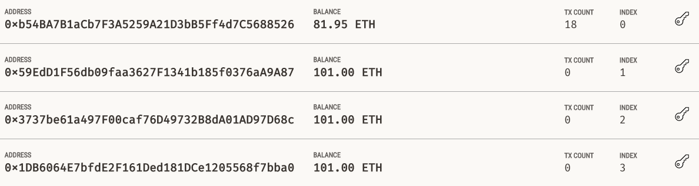
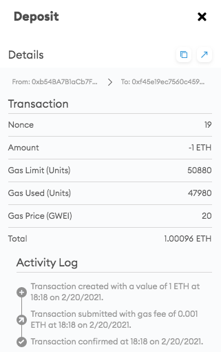
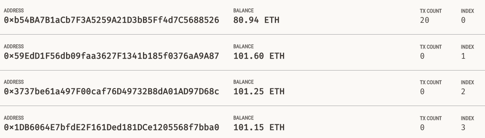

# Profit Splitter - "Looks like we've made our First Contract!"

## Files

* [`AssociateProfitSplitter.sol`](Solidity-Code/AssociateProfitSplitter.sol) -- Level 1 starter code.

* [`TieredProfitSplitter.sol`](Solidity-Code/TieredProfitSplitter.sol) -- Level 2 starter code.

* [`DeferredEquityPlan.sol`](Solidity-Code/DeferredEquityPlan.sol) -- Level 3 starter code.

## Level 1

Profit is split evenly between 3 employees.

## Level 2

Profit is split unevenly with 65% going to the first employee, 25% going to the second, and 15% going to the third.

## Level 3

Traditional company stock plan that manages the distribution of 1,000 shares over 4 years. Since the stock distribution plan is deferred, employees' accounts will be locked for the first year.
